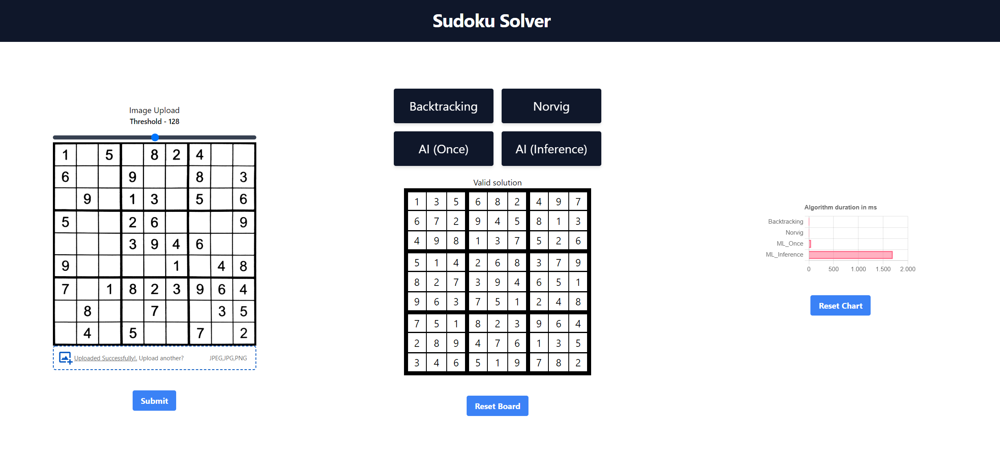

# sudoku-solver

sudoku-solver is a web application that can extract and solve Sudokus provides as images.



## Running

To make testing as easy as possible this application was packed into one single container that can be run with Docker.
> Hint: The size of the container is quite large (~4GB) and can therefore take a while to start
```
docker run -p 3000:3000 motzi/sudoku-solver
```

You should then be able to view the WebUI on: http://localhost:3000

> All tests were performed under Windows 10 (amd64)

Images for testing can be found in the directory images with the names `s0.png`, `s1.png`, `s2.png` and `s3.png`.
The last one is an example where the image processing is not working correctly probably due to inconsistent lighting of the image.

## Development

In this chapter will be explained how to start each of the services.

### Jupyter notebooks

To run the Jupyter notebooks, start by creating a virtual environment, activating it and installing the dependencies from the requirements file.
```console
python3 -m venv myvenv
.\venv\Scripts\Activate.ps1   // For windows
pip install -r requirements.txt
```

Then switch to the `notebooks` directory and start the Jupyter server
```console
jupyter notebook
```

To be able to run the notebooks, you need to download the dataset from Kaggle:

https://www.kaggle.com/datasets/bryanpark/sudoku

Then place the downloaded file under `notebooks/sudoku.csv` Now you can run the notebooks with the required dependencies.

### Python backend

For running the python backend the same virtual environment create in the previous chapter can be used.
Activate it and switch to the directory `backend` and run:
```bash
py api.py
```

### Nextjs frontend

For running the nextjs frontend switch to the directory `frontend` and run:

```bash
yarn install
yarn dev
```